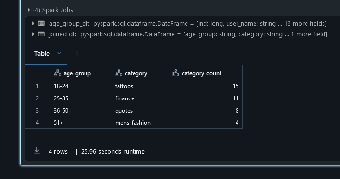
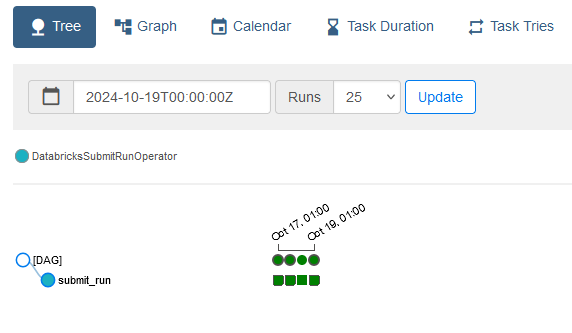
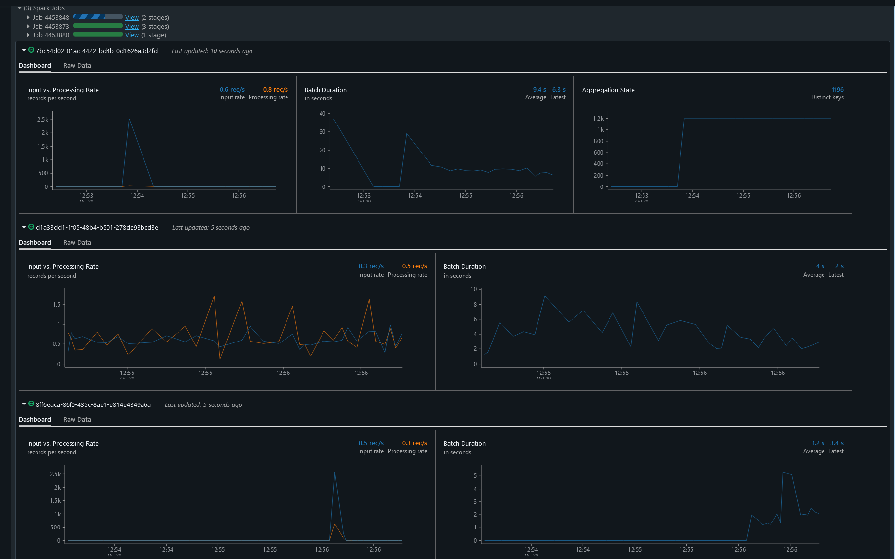

# Pinterest Data Pipeline

Creating a similar system to Pinterest using the AWS Cloud.

- [Pinterest Data Pipeline](#pinterest-data-pipeline)
  - [Project Description](#project-description)
  - [Project Structure](#project-structure)
  - [Setup Instructions](#setup-instructions)
  - [Usage Instructions](#usage-instructions)
    - [Sending Data to API](#sending-data-to-api)
      - [Setup Python Environment](#setup-python-environment)
      - [Emulate data sending to API:](#emulate-data-sending-to-api)
    - [Cleaning \& Analysing Data](#cleaning--analysing-data)
    - [Stream Processing with AWS Kinesis](#stream-processing-with-aws-kinesis)
  - [Reflection on Project](#reflection-on-project)
    - [Amazon Web Services](#amazon-web-services)
    - [Databricks](#databricks)
    - [Airflow](#airflow)
    - [Kinesis](#kinesis)
  - [License](#license)

## Project Description

This project aims to replicate an end-to-end pipeline for data processing similar to that used in Pinterest. Using AWS services like EC2, MSK, and S3, with integration into Databricks for analytics. Kafka is used for creating a system to collect streaming data, with storage in S3 and analysis in Databricks.

I have learned how to configure Kafka clusters, set up secure IAM authentication for Kafka topics, and manage S3 buckets. Additionally, I have been able to gain experience in mounting S3 buckets into Databricks. This has deepened my understanding of cloud-based data streaming and given me an opportunity to use these tools hands-on to produce a project that replicates one that is used in industry.

## Project Structure

- `databricks` contains Databricks Notebook code for data transformations and queries. Each file is explained in [Cleaning & Analysing Data](#cleaning--analysing-data)
- `airflow` contains DAG workflow for executing a Databricks Notebook.
- `src` contains the Python code for sending data to the API gateways
  - `connector.py` contains the class for fetching data from the RDS instance.
  - Apache Kafka, AWS API Gateway
    - `kafka_api.py` provides an interface for interacting with the MSK Cluster on AWS.
    - `api_conf.example.yaml` is an example configuration for the `KafkaAPI` class.
    - `user_posting_emulation.py` is used to fetch data from an RDS database, and then send the data to the MSK Cluster via `KafkaAPI`.
  - AWS Kinesis, AWS API Gateway
    - `kinesis_api.py` provides an interface for interacting with the Kinesis Streams on AWS.
    - `stream_api_conf.example.yaml` is an example configuration for the `KinesisAPI` class.
    - `user_posting_emulation_streams.py` is used to fetch data from an RDS database, and then send the data to the Kinesis streams via `KinesisAPI`
- `db_creds.example.yaml` is an example configuration for connecting to the RDS instance, used in both `.\src\user_posting_emulation.py` and `.\src\user_posting_emulation_streams.py`

## Setup Instructions

Please read [SETUP](SETUP.md) to see extensive setup instructions.

## Usage Instructions

### Sending Data to API

#### Setup Python Environment

1. Ensure Python is installed with `python --version`. This project uses Python 3.12
2. Create the environment with `python -m venv .venv`
3. Activate the environment:
   1. Windows command prompt: `.venv\Scripts\activate`
   2. Windows PowerShell: `.venv\Scripts\Activate.ps1`
   3. Linux/Mac: `source .venv\bin\activate`
4. Install requirements with `pip install -r requirements.txt`

#### Emulate data sending to API:

1. Run `python .\src\user_posting_emulation.py` to begin emulating user data being sent to the Kafka REST API.

### Cleaning & Analysing Data

Using Databricks notebooks, data is extracted from the S3 bucket, then put into Spark Dataframes, for transformation. After cleaning the data, analysis can be performed with queries.

Inside the `databricks` folder:

1. **Imports and Common Functions**: PySpark imports, grabbing AWS User ID from Databricks widget, and common functions such as creating a Dataframe from a Kafka topic.
2. **Create Dataframes**: This notebook creates each Dataframe for Pin/Posts, Geo, and User data.
3. **Clean Pin Data**: Steps for transforming the data in the Pin/Posts Dataframe.
4. **Clean Geo Data**: Steps for transforming the data in the Geo Dataframe.
5. **Clean User Data**: Steps for transforming the data in the Users Dataframe.
6. **Querying Data**: Various queries on the cleaned data to gather insights. First creates the Dataframes (2), then runs transformations (3, 4, 5)
7. **Transformation Functions**: Wraps the cleaning notebooks (3, 4, 5) into singular functions, ready to be used for transformations of Kinesis streams.
8. **Kinesis Streams**: Defines stream structure, and properties, to extract, transform, and load streams into Delta tables.
9. **Mount S3 Bucket (Legacy)**: The previous way of mounting an S3 bucket to Databricks. Now, Databricks directly accesses the S3 bucket, rather than through its own filesystem.

### Stream Processing with AWS Kinesis

1. Run `python .\src\user_posting_emulation_streams.py` to begin emulating user data being sent to the Kinesis REST API.
2. Using the **Kinesis Streams** notebook, run it to start extracting, transforming, and loading the stream data into Delta tables in DataBricks

## Reflection on Project

### Amazon Web Services

Working with AWS has sigificantly improved my practical understanding of cloud computing and data streaming technologies. Creating and using an EC2 instance to run Kafka REST using Confluent was one of these hands-on experiences. Navigating and using the AWS console was easy to follow, as it hasn't changed much from the instructions. This made it easier for me to focus on implementation rather than navigating a complex process.

I encountered a problem when trying to run the Kafka REST script on the EC2 instance, where I had selected the wrong script to run. It was mentioning memory errors, and I thought that was strange for it to not be able to run on the provided EC2 model. After some troubleshooting I then realized I was running the wrong script, which emphasized to me to pay attention to the smaller details.

Creating Kafka topics and running the REST instance was interesting, especially to see data flowing into the pipeline, providing feedback that I had implemented the processes correctly.

While certain aspects of the environment had already been setup, such as the Managed Workflows for Apache Airflow (MWAA) cluster and IAM roles, I was still able to gain insight into how these function, including the significance of IAM roles securing access and permissions, and the overall architecture of data workflows within the cloud.

### Databricks

One improvement I could make to my Databricks Notebook code is finding repetitive code, and creating a function from it. However, for sake of clarity of what I was performing on each step, I kept it how it is, and these transformations or queries could need to be adjusted depending on the requirements.

While there is similarities to PySpark and Pandas for data transformations and cleaning, I did find I had to research into PySpark more to understand how to join statements together to get the results I wanted. Additionally, I discovered that the PySpark version on the Databricks cluster was running a few versions behind, so I looked up an alternative for finding the `median`, in this case `perentile_approx`.

Overall, I was sucessfully able to produce analytics on the data. These kinds of queries could be used to gain valuable insights into user behaviour, identify trends over time, and support data-driven decision making. For example, one query determines which topics are most popular for each age group, which this information could be used for targeted advert campaigns.

### Airflow

Creating a Directed Acyclic Graph (DAG) and uploading it was a trivial process, especially as there is extensive documentation on Airflow's website with numerous examples. In this case, my workflow is simple, just running one task, which executes a single Databricks Notebook. A future improvement could be to execute each notebook I created in the order I want, such as gathering data, cleaning data, and then lastly querying data. At the moment, the notebooks run dependencies on other notebooks themselves, eliminating the need for multiple tasks in the DAG.

### Kinesis

Using AWS Kinesis streams allowed me to understand how big data is handled in the industry and processed for real-time analytics. Initially, I wrote code to only process one Kinesis stream, to visualise the incoming data into Databricks.

I could see I needed to extract the JSON payload and then create a Dataframe from that, to perform transformations. I tried to chain notebooks together to avoid rewriting the same transformation code, but with the way Spark streams work in DataBricks, they block the current cell indefinitely.

Instead, I programmed it in such a way where I create a configuration of each of the stream, such as its name, schema, and transformation function. From this, I could loop over each one, and then perform creating the stream, running the transformation function, and lastly writing the transformed data into a Delta table. Running this code provided exciting visualisation of the incoming data and processing times of transformation, and I could confirm the data was being saved correctly in the Delta tables.

## License

MIT License. See `LICENSE` file for more information.
